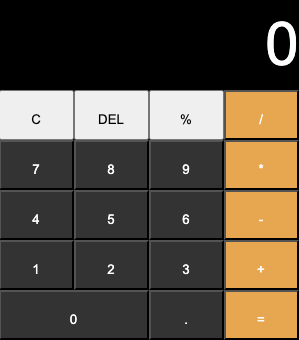

# Calculator

## Context
This project aims to create a functional calculator using JavaScript, HTML, and CSS, reinforcing fundamental programming concepts such as event handling, DOM manipulation, and basic arithmetic operations.

## Skills and Tools Used
### HTML:
- Structural elements: `
` and `<button>`

### CSS:
- Basic styling: colors, margins, paddings, borders
- Flexbox for layout alignment

### JavaScript:
- DOM Manipulation: dynamically updating display values
- Event listeners for button clicks
- Functions for basic arithmetic operations (`add`, `subtract`, `multiply`, `divide`)
- Implementing "clear", "delete", and "percentage" functions

## Features
- **Basic Arithmetic:** Supports addition, subtraction, multiplication, and division.
- **Live Display Update:** Displays user input and results in real-time.
- **Clear and Delete Buttons:** Reset or modify the current input.
- **Percentage Button:** Convert numerical output into percentage.

## Final Product
Below is a sample screenshot of the Calculator app:

